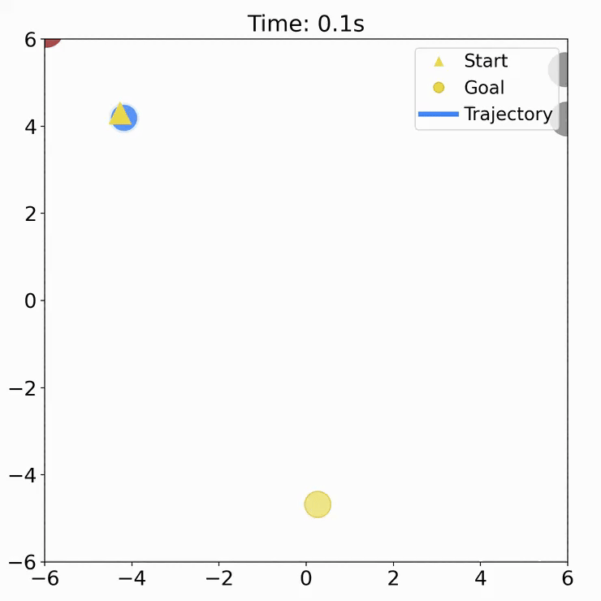
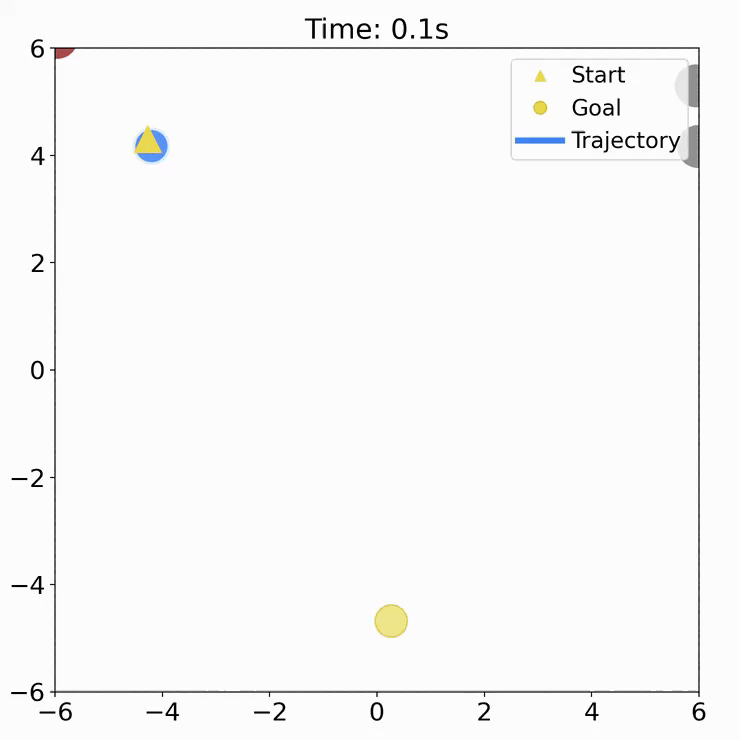
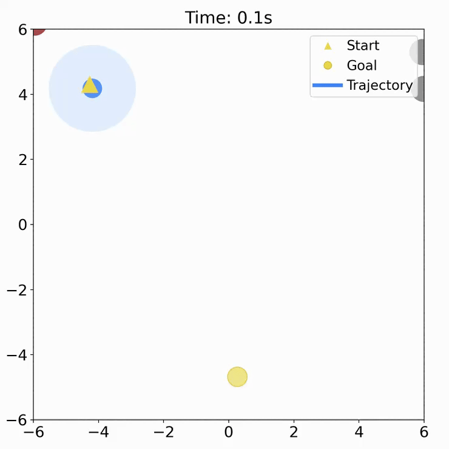

# Reinforcement Learning Adaptive CVaR Barrier Function

Crowd navigation scneario

High-density out-of-distribution comparison (2× speed), from the original release on `main`.


| RL             | RL+SF                          | CVaR-BF-QP             | Ours               |
| -------------- | ------------------------------ | ---------------------- | ------------------ |
|  |  |  |  |
| RL — collision | RL + Safety Filter — collision | CVaR-BF-QP — collision | **Ours — success** |


## Install

Clone the `main_jax` branch and create the environment. 

```bash
git clone --branch main_jax https://github.com/anonymousrobotics9666/Reinforcement-Learning-Adaptive-CVaR-Barrier-Function.git
cd Reinforcement-Learning-Adaptive-CVaR-Barrier-Function
conda env create -f environment.yml
conda activate diff_cvar_jax
```

Install the appropriate [JAX build](https://docs.jax.dev/en/latest/installation.html) after activating the environment, then install Optax:

```bash
# CPU
python -m pip install --upgrade jax
# NVIDIA CUDA 12: use this instead of the CPU command
# python -m pip install --upgrade "jax[cuda12]"
python -m pip install "optax==0.2.8"
```

JAX and Optax are intentionally not included in `environment.yml`.

<!-- ## Quick Start -->

<!-- Verify the installation and available devices:

```bash
python -c "import jax, optax; print(jax.devices()); print(optax.__version__)" -->
```

## Train

Default DiffCVaR-MLP-CBF-QP training:

```bash
RUN_NAME=diff_cvar_mlp bash scripts/run_ppo.sh
```

Train the PPO-MLP baseline:

```bash
RUN_NAME=ppo_mlp bash scripts/run_ppo.sh model=ppo_mlp
```

Outputs are saved under:

```text
outputs/crowd_dyn_var_num_env/runs/<run>/
```

Each run contains `config.yaml`; training evaluation saves `ckpt_<step>.pkl` and `ckpt_manifest.json`. Old PyTorch `.pt` checkpoints are not compatible with this JAX branch.

## Common Overrides

Common options can be changed from the shell launcher:


| Option           | Values / example                              |
| ---------------- | --------------------------------------------- |
| Model            | `model=diff_cvar_mlp` or `model=ppo_mlp`      |
| Environment      | `env=crowd_dyn_var_num_env`                  |
| Robot            | `robot=single_integrator` or `robot=unicycle` |
| Number of humans | `env.humans.num_humans=15`                    |


Example:

```bash
RUN_NAME=demo bash scripts/run_ppo.sh model=diff_cvar_mlp robot=single_integrator \
  env.humans.num_humans=15
```

For all other parameters, see the YAML files under `config/`.

## W&B Logging

For offline logging:

```bash
WANDB_MODE=offline RUN_NAME=offline_run bash scripts/run_ppo.sh
```

For online logging:  

```bash
wandb login
RUN_NAME=online_run WANDB_PROJECT=<project_name> WANDB_ENTITY=<user_or_team> bash scripts/run_ppo.sh
```

## Evaluate

List checkpoints:

```bash
ls outputs/crowd_dyn_var_num_env/runs
ls outputs/crowd_dyn_var_num_env/runs/<run>/ckpt_*.pkl
```

Evaluate one checkpoint:

```bash
python scripts/eval.py \
  --save-dir outputs/crowd_dyn_var_num_env/runs/<run> \
  --checkpoint outputs/crowd_dyn_var_num_env/runs/<run>/ckpt_<step>.pkl
```

Save rollout MP4s:

```bash
python scripts/eval.py \
  --save-dir outputs/crowd_dyn_var_num_env/runs/<run> \
  --checkpoint outputs/crowd_dyn_var_num_env/runs/<run>/ckpt_<step>.pkl \
  --visualize \
  --seeds 100,200 --episodes 1
```

## Repository Layout

```text
config/      Hydra configs
env/         JAX crowd navigation environments
model/       PPO-MLP and DiffCVaR-MLP-CBF-QP models
solver/      Differentiable JAX QP solver
trainer/     JAX PPO training loop and checkpointing
scripts/     Training and evaluation entrypoints
```

## Acknowledgments

Thank the authors of [CrowdNav_Prediction_AttnGraph](https://github.com/Shuijing725/CrowdNav_Prediction_AttnGraph) for the crowd navigation environment and baseline references, [PPO-for-Beginners](https://github.com/ericyangyu/PPO-for-Beginners) for the clear PPO baseline implementation, and [locuslab/qpth](https://github.com/locuslab/qpth) for differentiable quadratic programming.
